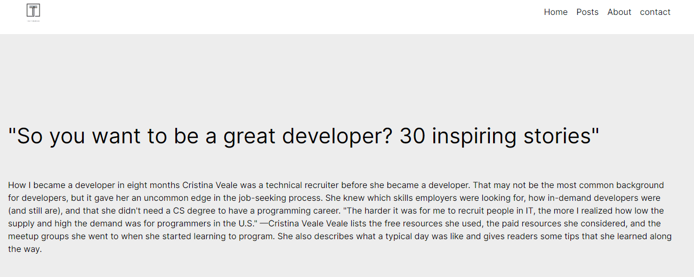

# React.js Blog App



## Overview

A simple blog application built with React.js and Firebase as the backend. to view blog posts.

## Table of Contents

- [Features](#features)
- [Technologies Used](#technologies-used)
- [Installation](#installation)

## Features

- Responsive Navbar
- Fetch data from firbase
- Display Blog Posts
- View Single Post

## Technologies Used

- React.js
- Firebase (Firestore for database)

## Installation

1. Clone the repository:

   ```bash
   git clone https://github.com/your-username/react-blog-app.git
   ```
